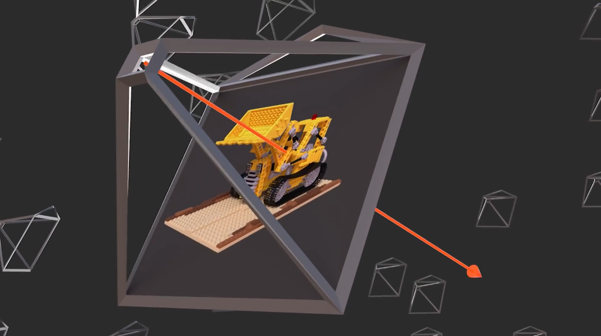
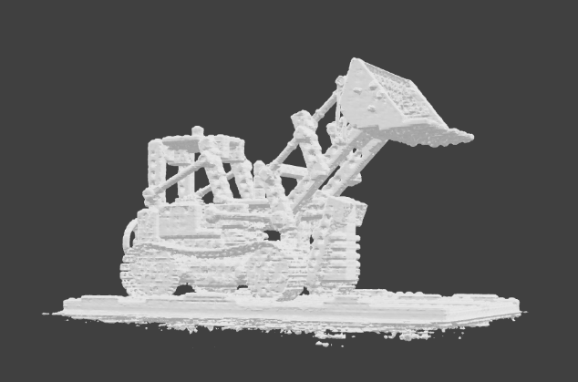

# 颠覆传统三维重建方法之nerf(二)---原理

### 一. 基本流程
1. 相机在不同的位置拍摄了一组目标场景的照片
    - 如果你是手机拍摄的一段视频可以用colormap转
    
2. 从相机光心开始，沿着某个像素方向发送一条光线。
    - 这里跟真实的相机成像模型光线方向是相反的，但不影响。
    
3. 根据神经网络F，算出光线穿过场景是每个位置的:颜色和密度
    
4. 把这条光线上所有位置上的颜色和密度合成，就能算出图上的像素rgb值。
    - 根据输入的一组图像上的像素rgb值，不断去优化可微函数F。
    - 优化次数足够，就可以直接算出所有视角下图上的像素rgb值。
    
5. 用marching cube算法转换为三角网三维模型
    

### 二. 物理模型
1. 场景由发光粒子组成。
2. 发光粒子只会吸收(透明度/透射率/密度的反比/图像颜色的贡献率)和发射(颜色值)，没有散射。不会改变光线的传播方向。
3. 发光粒子的密度δ：只跟位置x,y,z有关。
4. 发光例子的颜色rgb：除了跟位置x,y,z有关，还有观察角度θ,φ有关。

### 三. 个人总结
在计算机图形学里面，有一种三维渲染叫：体渲染。这个渲染过程可以用来三维重建。
1. 作者对体渲染的光学模型做了一写假设，建立一个数学模型。
2. 作者把重建过程离散化后实现函数可微，也就能反向传播和训练。
3. 作者把其中的计算rgbδ用深度学习替代。
4. 所以整个过程就是：实现基于神经网络的体渲染方法的三维重建。
5. 特点就是直接基于拍摄的图像重建，重建的纹理就来自图像，所以跟真实的场景很像。

### 四. 参考
1. 什么是体渲染(体素渲染/光线投射/光线步进)：博客+视频连接：https://zhuanlan.zhihu.com/p/491364937