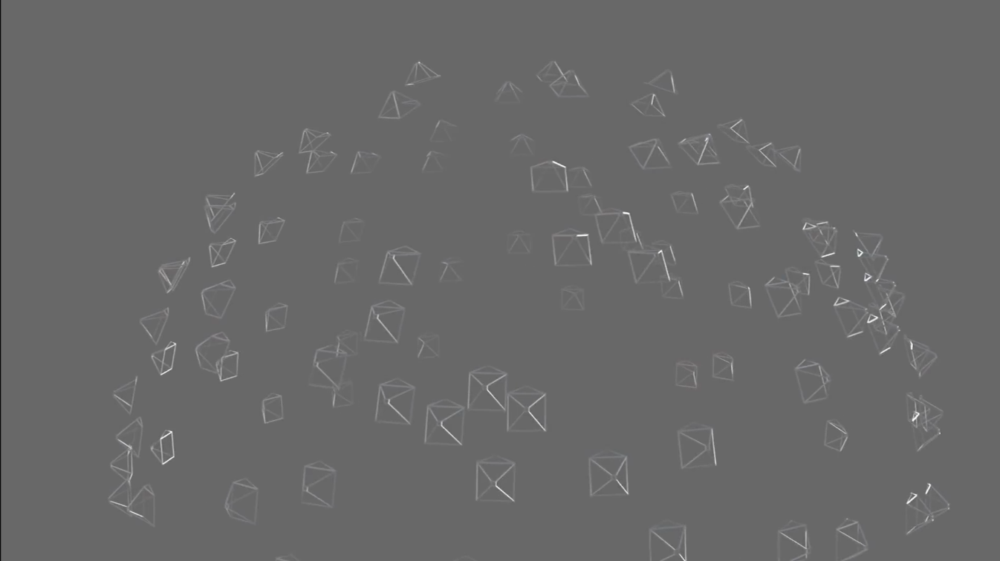

# 颠覆传统三维重建方法之nerf(二)---原理

### 二. 看看
相机再不同的位置拍摄了一组照片

### 物理基础：体渲染/体渲染/体素渲染/光线投射/
1. 什么是体渲染：博客+视频连接：https://zhuanlan.zhihu.com/p/491364937
1. nerf体渲染方法：光线步进
2. nerf三个假设：
    - 场景由发光粒子组成
    - 发光粒子只会吸收(透明度/透射率/密度的反比/图像颜色的贡献率)和发射(颜色值)，没有散射。不会改变传播方向。
    - 发光粒子发射的光不会因为官方方向和角度不同而又不同。粒子本身从各个角度看都是一样的颜色。
4. 建立模型：
5. 离散化求解：同质媒介

在计算机图形学里面，有一种三维渲染叫：体渲染。    这个渲染过程可以用来三维重建
1. 作者对体渲染的光学模型做了一下假设，建立一个数学模型。
2. 作者把重建过程离散化后实现可微，也就能反向传播和训练。
3. 作者把其中的两步用深度学习替代。
所以整个过程就是：实现基于神经网络的体渲染方法 的三维重建

特点就是 直接基于拍摄的图像重建， 重建的纹理就来自图像，所以跟真实的场景一模一样