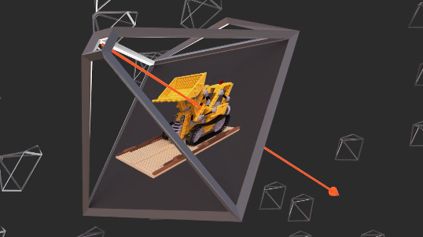
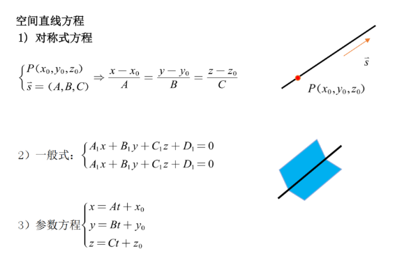
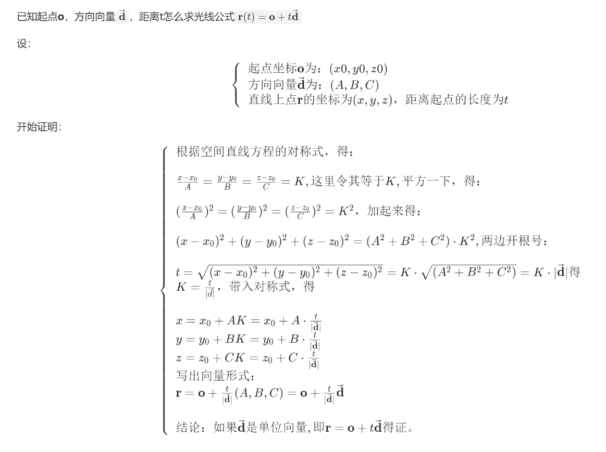

# 颠覆传统三维重建方法之nerf(三)---光线的数学表示与采样点
>nerf说：一条光线上所有位置上的颜色和密度的合成，就是图上的像素RGB值；
>我们来看看这条光线怎么表示？　以及怎么在光线上取一些点？

### 一. nerf的光线表示
光线是一条空间直线，准确的说是一条空间射线，定义公式如下:
    

<!--  -->

- 起点坐标 ：相机中心点：**o**
- 方向向量 ：从相机中心点出发，到图像某个像素坐标的向量：**d**。 两坐标相减就得到。
- t：光线上的点到起点的距离。 t取不同的值就是光线上不同的采样点。

如下图：

<!--  -->
- 400x400的图像可以生成160000条光线。
- 根据小孔成像模型，图像应该在上图光线的反方向，nerf代码强制取-1变成正向。

### 二. 复习向量与空间解析几何的空间直线的表示
> P是空间直线上一点，S是方向向量，有如图的三种表示法


<!--  -->

### 三. nerf光线公式的推导

<!--  -->

<!--
已知起点**o**，方向向量`$\bold{\vec{d}}$`，距离t怎么求光线公式`$\bold{r}(t) = \bold{o} + t\bold{\vec{d}} $`

设：

```math
\left \{ \begin{array}{l}
起点坐标\bold{o}为：(x0, y0, z0) \\
方向向量\bold{\vec{d}}为：(A,  B,  C) \\
直线上点\bold{r}的坐标为(x, y, z)，距离起点的长度为t \\
\end{array} \right.
```

开始证明：

```math
\left \{ \begin{array}{l}
根据空间直线方程的对称式，得：\\
\\
\frac{x-x_0}{A} = \frac{y-y_0}{B} = \frac{z-z_0}{C}  = K  , 这里令其等于K, 平方一下，得：            \\
\\
(\frac{x-x_0}{A})^2 = (\frac{y-y_0}{B})^2 = (\frac{z-z_0}{C})^2 = K^2，加起来得：     \\
\\
 (x-x_0)^2 + (y-y_0)^2 + (z-z_0)^2 = (A^2 + B^2 + C^2) \cdot K^2 , 两边开根号：            \\
 \\
 t = \sqrt{(x-x_0)^2 + (y-y_0)^2 + (z-z_0)^2} = K \cdot \sqrt{ (A^2 + B^2 + C^2)} = K \cdot |\bold{\vec{d}}| 得 \\
 K = \frac{t}{|\vec{d}|} ，带入对称式，得 \\
\\
 x = x_0 + AK = x_0 + A \cdot \frac{t}{|\bold{\vec{d}}|}   \\
 y = y_0 + BK = y_0 + B \cdot \frac{t}{|\bold{\vec{d}}|} \\
 z = z_0 + CK = z_0 + C \cdot \frac{t}{|\bold{\vec{d}}|} \\
 写出向量形式：\\
 \bold{r}= \bold{o} + \frac{t}{|\bold{\vec{d}}|} (A,B,C) = \bold{o} + \frac{t}{|\bold{\vec{d}}|}\bold{\vec{d}}  \\
 \\
 结论：如果\bold{\vec{d}}是单位向量, 即\bold{r} = \bold{o} + t\bold{\vec{d}}得证。\\
\end{array} \right.
```
-->
### 四. 应用与分析
1. 证明表示，方向向量`$\bold{\vec{d}}$`需要是单位向量。
2. nerf在把图像还原到世界坐标系时，因为深度已经丢失，nerf把z坐标直接相机坐标系取-1。
3. 这样相机中心到图像中心的光线的方向向量刚好就是单位向量。 但其他光线不是但很接近，所以这不影响结果。
4. 取-1代码如下： -torch.ones_like(i)。 既保证了光线的方向，有保证方向向量接近单位向量。
    ```
   #光线的起点和方向向量
    def get_rays(H, W, K, c2w):
        i, j = torch.meshgrid(torch.linspace(0, W-1, W), torch.linspace(0, H-1, H))
        i = i.t()
        j = j.t()
        dirs = torch.stack([(i-K[0][2])/K[0][0], -(j-K[1][2])/K[1][1], -torch.ones_like(i)], -1)
        rays_d = torch.sum(dirs[..., np.newaxis, :] * c2w[:3,:3], -1) 
        rays_o = c2w[:3,-1].expand(rays_d.shape)
        return rays_o, rays_d
    ```
   ```
    #光线采样
    z_vals = tf.linspace(near, far, N_samples) 
    pts = rays_o[...,None,:] + rays_d[...,None,:] * z_vals[...,:,None]
   ```
5. 代码分析
    - dirs是相机坐标系下的光线方向。
    - rays_d是世界坐标系下的光线方向，为什么用点乘＋求和：因为输入是行向量不能直接像列向量那样用矩阵乘法。
    - rays_o是世界坐标系下的光线起点。
