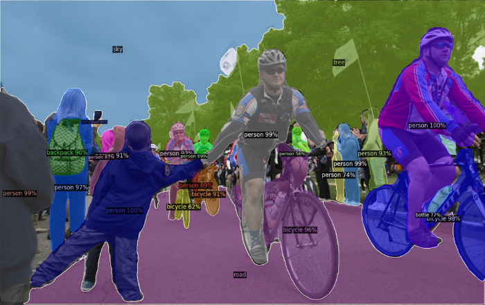
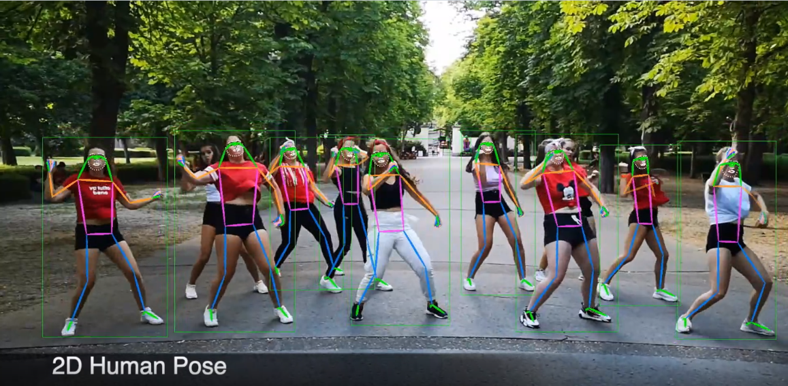
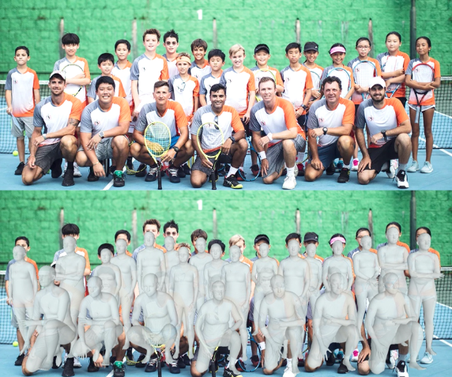

# NeuMan的数据预处理
> 数据预处理：从视频生成训练数据的过程

### 一. 训练数据的结构（参考data/bike）
```
data/bike
├── densepose       #detectron2做densepose_rcnn             ：*.png.npy
├── depth_maps      #colmap得到的深度信息                     ：*.png.geometric.bin
├── images          #colmap筛选的图片信息                     ：*.png
├── keypoints       #mmpose的关键点检测                       ：*.png.npy
├── mono_depth      #BoostingMonocularDepth的单目深度估计     ：*.png
├── segmentations   #detectron2根据colmap筛选的图片做的分割    ：*.png
├── smpl_pred       #ROMP人体编码                            ：*.png.npz
├── sparse          #colmap得到的相机信息                     ：cameras.txt, images.txt, points3D.txt
├── alignments.npy  
├── smpl_output_optimized.pkl
└── smpl_output_romp.pkl
```
### 二. 预处理依赖项目
 1. [COLMAP](https://github.com/colmap/colmap.git) 及其依赖[ceres-solver](https://github.com/ceres-solver/ceres-solver.git)  ：传统多视图三维重建管线。 似乎要求3.6版本。
 
 2. [Detectron2](https://github.com/jiangwei221/detectron2.git) ：目标检测和分割，DensePose。
 
 3. [mmpose](https://github.com/jiangwei221/mmpose.git) ：姿态估计。
 
 4. [ROMP](https://github.com/jiangwei221/ROMP.git) : 单目、一阶段、多人的3D人物回归。
 
 5. [BoostingMonocularDepth](https://github.com/compphoto/BoostingMonocularDepth) ：单图三维估计
 
 ```
git clone https://github.com/ceres-solver/ceres-solver.git --branch 1.14.0
git clone https://github.com/colmap/colmap.git
cd colmap
git checkout 96d4ba0b55c0d1f98c8c432420ecd6540868c398
cd ..

git clone --recurse-submodules https://github.com/compphoto/BoostingMonocularDepth.git
cd BoostingMonocularDepth
git checkout ecedd0c0cf5e1807cdab1c5154351a97168e710d
cd ..

git clone --recurse-submodules https://github.com/jiangwei221/ROMP.git
cd ROMP
git checkout f1aaf0c1d90435bbeabe39cf04b15e12906c6111
cd ..

git clone --recurse-submodules https://github.com/jiangwei221/detectron2.git
cd detectron2
git checkout 2048058b6790869e5add8832db2c90c556c24a3e
cd ..

git clone --recurse-submodules https://github.com/jiangwei221/mmpose.git 
cd mmpose
git checkout 8b788f93200ce6485e885da0c736f114e4de8eaf
cd ..
```
 
 ### 二. 预处理流程 一共10步
 1. 用save_video_frames.py从视频获取帧。 输入到messi\raw_720p
 2. 用detectron2\demo做mask_rcnn图像分割后得到mask。输入messi\raw_masks
 3. 用colmap做稀疏场景三维重建。最终输出到：messi/output/images，depth_maps，sparse
    - feature_extractor: 根据图像和分割mask提取特征到messi\recon\db.db
    - exhaustive_matcher: 修改db.db文件
    - mapper：输入到messis\recon\sparse
    - image_undistorter
    - patch_match_stereo
    - model_converter
  4. 用detectron2\demo对messi/output/images/*.png做mask_rcnn分割到messi\output\segmentations
  5. 用detectron2\projects\DensePose(建立像素和3D对象几何之间的密集对应关系)做densepose_rcnn到output\densepose\output.pkl
     ```
     注释了一行
     # assert int(os.path.basename(pred['file_name'])[:-4]) == i
     ```
  6. 用mmpose做关键点检测，到messi/output/keypoints
     ```
     pip install mmcv==1.3.8
     python -m pip install -e mmpose
     ```
  7. 用BoostingMonocularDepth做单目深度估计，到messi/output/mono_depth
  8. 用ROMP做SMPL(人体参数编码模型),输出到\messi\output\smpl_pred。
  9. 用export_alignment.py对smpl对齐  
  10. 用optimize_smpl.py做SMPL的silhouette优化
  
 
 
 
    
 
 
