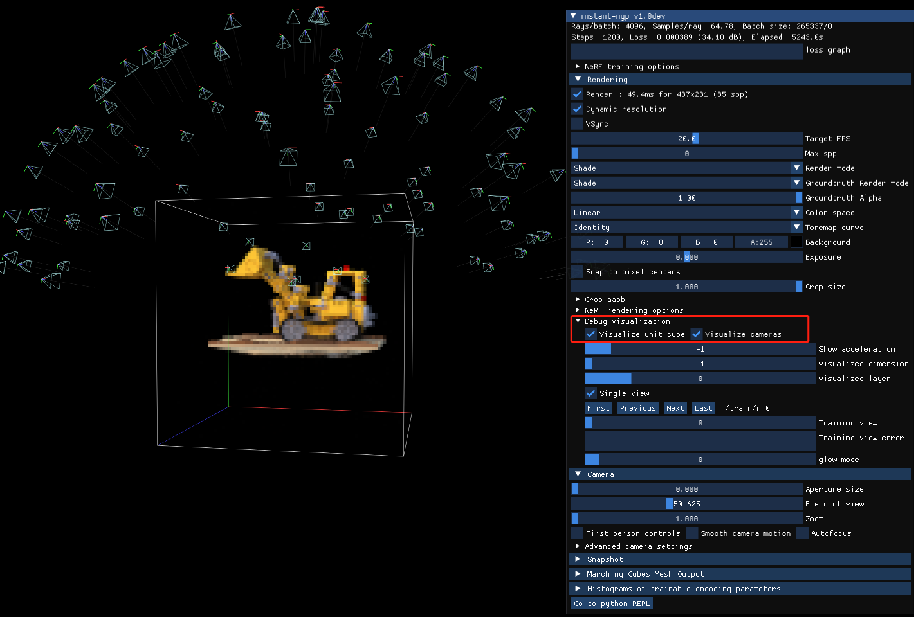

# 用colormap和Record3D准备ngp需要的数据集
> 支持三种数据类型：一段视频，一系列图片，苹果公司Record3D文件

### 一. 准备资料
- 官方文档：https://github.com/NVlabs/instant-ngp/blob/master/docs/nerf_dataset_tips.md
- 官方学习视频：https://www.youtube.com/watch?v=3TWxO1PftMc
- 官方实现：scripts/colmap2nerf.py  scripts/record3d2nerf.py 

### 二. 对数据集要求
> NeRF ngp模型在20秒左右后如果没有效果，那么经过长时间的训练后它不太可能变得更好。
1. 图像太少不行：数据集具有良好的覆盖范围；最好使用 50-150 张图像进行训练。
2. 相机参数不准确不行：不包含错误标记的相机数据；重建的质量取决于准确的相机参数。
3. 图像模糊不行：比如运动模糊和散焦模糊都不行
4. 最佳效果：图像都大致指向一个共同的兴趣点，并将其放置在原点。
5. nerf默认只能处理静态场景

### 三. 关于场景范围、缩放、位移
1. ngp默认只处理场景：单位立方体[0, 0, 0] to [1, 1, 1]；要调整场景在transforms.json的最外层使用下列参数：
    - aabb_scale：默认1，设置处理场景范围
    - scale：默认0.33，缩放
    - offset: 默认[0.5, 0.5, 0.5]，位移
2. 可视化调试:【相机的位姿】和【单位立方体】，以便检查数据
"Debug visualization"下的"Visualize cameras" and "Visualize unit cube"


### 四. 用COLMAP从您拍摄的一组照片或视频创建数据集
1. 把COLMAP和FFmpeg命令行工具安装好，设置到path。
2. 对于视频
    ```
    python scripts/colmap2nerf.py --video_in <filename of video> --video_fps 2 --run_colmap --aabb_scale 16
    ```
3. 对于图片
   ```
   python scripts/colmap2nerf.py --colmap_matcher exhaustive --run_colmap --aabb_scale 16
   ```
   
###　五. 使用更强大的[Record3D App](https://record3d.app) 从iPhone 12 Pro或更新版本（基于 ARKit）创建数据集。 
1. 录制视频并以“可共享/内部格式 (.r3d)”导出。
2. 运行预处理脚本record3d2nerf.py：
```python scripts/record3d2nerf.py --scene path/to/data```

###　六. colmap2nerf.py分析colmap处理步骤
- colmap feature_extractor：提取特征
- colmap {args.colmap_matcher}_matcher：特征匹配
- colmap mapper：位姿求解
- colmap bundle_adjuster：调整
- colmap model_converter：转换


