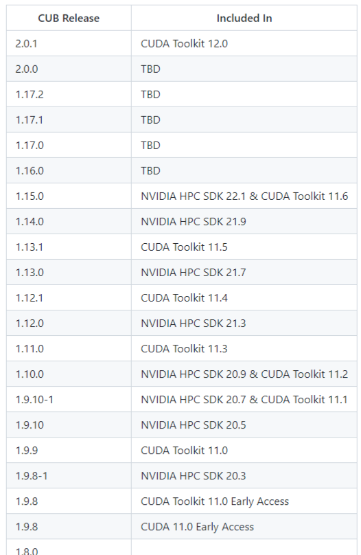

# neuman windows环境搭建

### 一. 环境搭建经验和指导
1. windows整个环境最麻烦的就是pytorch3d的安装，要以它为准。需要从源码自己编译安装。
2. 源码编译pytorch3d，需要以下软件且版本要匹配，且pytorch不能太低：
    - cuda的c语言sdk
    - pytorch。
    - cudatoolkit
    - nvidia cub
    - visual studio c++环境。
3. 所以安装顺序：
    1. 安装vs2009，至少要安装c++桌面开发组件。
    2. pytorch和cudatoolkit。 这样就确定了cudatoolkit的版本。
    3. 根据上一步确定的cudatoolkit版，安装同样版本的cuda的c语言sdk版本。
    4. 下载NVIDIA cub的对应版本。
    4. 源码编译安装pytorch3d。
    5. 安装igl等neuman的其他依赖。
### 二. 环境搭建    
1. pytorch3d编译方案：
    - pytorch3d用v0.7.2
    - pytorch3d要求：python用3.8, 3.9 or 3.10
    - pytorch3d要求：pytorch用1.9.0, 1.9.1, 1.10.0, 1.10.1, 1.10.2, 1.11.0, 1.12.0, 1.12.1 or 1.13.0
    - cudatoolkit根据pytorch的版本对应选择，如果用11.7，就不用装nvidia-cub了,结果发现cub版本1.15不匹配需要的1.17.
    - 源码编译pytorch3d
2. 实施过程
```
# 1.删除创建激活虚拟环境
conda remove -n neuman_env --all
conda create -n neuman_env
conda activate neuman_env

# 2. 安装pytorch和cudatoolkit
conda install pytorch==1.12.1 torchvision==0.13.1 torchaudio==0.12.1 cudatoolkit=11.3 -c pytorch
# 测试代码 python: import torch ; print(torch.__version__,torch.cuda.is_available())

# 3. 安装pytorch3d其他依赖
conda install -c fvcore -c iopath -c conda-forge fvcore iopath

# 4. 源码编译pytorch3d
# 4.1 下载https://github.com/NVIDIA/cub/archive/refs/tags/1.11.0.zip
set CUB_HOME=D:\yangkang\cub-1.11.0
# 4.2 开启vc编译环境
"C:\Program Files (x86)\Microsoft Visual Studio\2019\Enterprise\VC\Auxiliary\Build\vcvars64.bat"
# 4.3设置环境变量
set FORCE_CUDA=1
set DISTUTILS_USE_SDK=1
set PYTORCH3D_NO_NINJA=0

# 4.4 遇到找不到corecrt.h和basetsd.h”、rc.exe、link失败
set INCLUDE=C:\Program Files (x86)\Windows Kits\10\Include\10.0.22000.0\um;C:\Program Files (x86)\Windows Kits\10\Include\10.0.22000.0\ucrt;C:\Program Files (x86)\Windows Kits\10\Include\10.0.22000.0\shared;%INCLUDE%
set LIB=C:\Program Files (x86)\Windows Kits\10\Lib\10.0.22000.0\um\x64;C:\Program Files (x86)\Windows Kits\10\Lib\10.0.22000.0\uCRT\x64;%LIB%
set PATH=C:\Program Files (x86)\Windows Kits\10\bin\10.0.22000.0\x64;%PATH%

# 4.5编译
python setup.py install
# 4.6测试代码 python: import pytorch3d; print(pytorch3d.__version__)
#--------------pytorch3d安装完毕------------------

# 5. 安装neuman依赖
conda install -c conda-forge igl
pip install opencv-python joblib open3d imageio tensorboardX chumpy lpips scikit-image ipython matplotlib
```

### 三. 参考
- 一定先看：https://github.com/facebookresearch/pytorch3d/blob/main/INSTALL.md
- pytorch的安装：https://pytorch.org/get-started/previous-versions/
- 参考pytoch3的编译：https://blog.csdn.net/weixin_44136697/article/details/127061618
- 参考pytoch3的编译2：https://blog.csdn.net/zaf0516/article/details/125011964
- 关于cuda安装失败问题：https://blog.csdn.net/Redamancy06/article/details/125809903
- 发现cuda11.7自带的cub版本不匹配：https://github.com/facebookresearch/pytorch3d/issues/1227
    ```
    C:\ProgramData\Anaconda3\envs\neuman_env\include\cub 默认是1.15 替换成1.17
    C:\Program Files\NVIDIA GPU Computing Toolkit\CUDA\v11.7\include\cub 默认是1.15 替换成1.17
    C:\ProgramData\Anaconda3\envs\neuman_env\include\thrust\system\cuda\config.h
    ```
- cub与cudatoolkit版本对应图： 